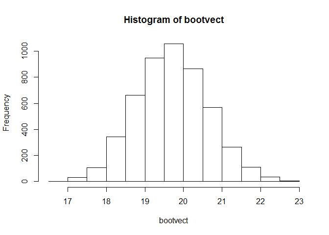
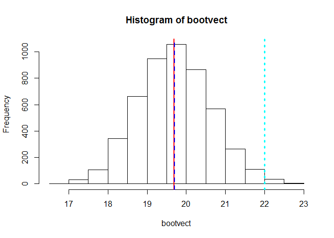
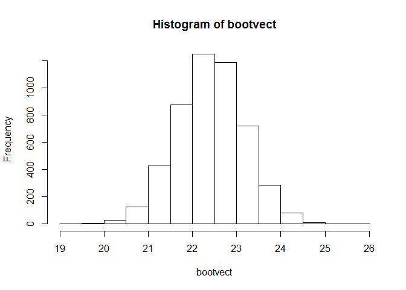
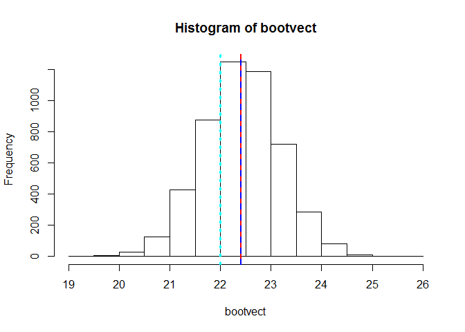
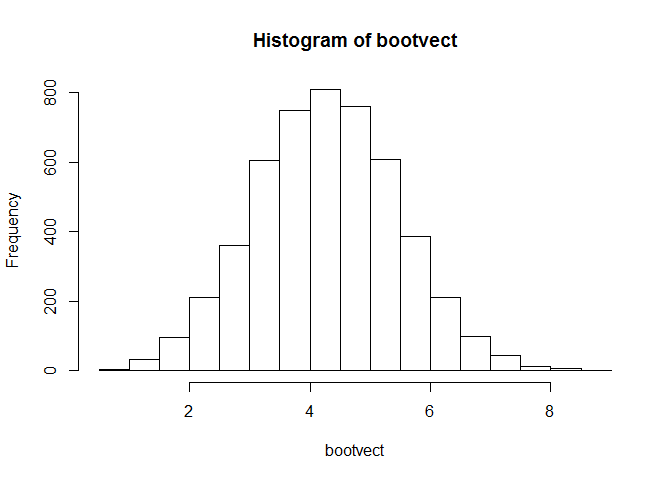
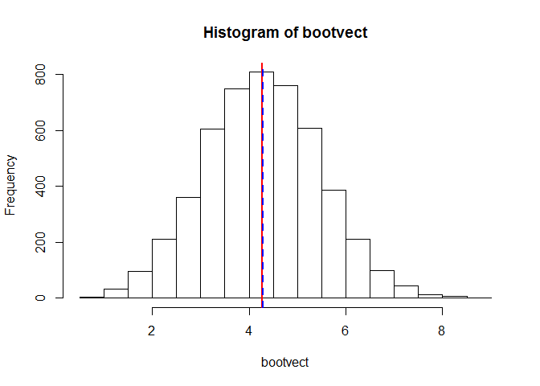
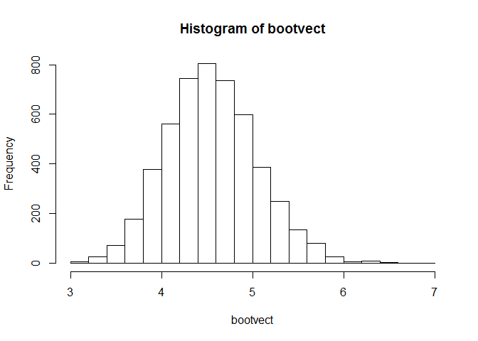
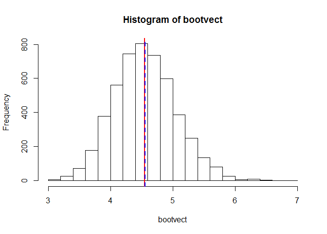

# Bootstrap And The Central Limit Theorem
Celia Taylor - Homework 4 Assignment Doing Data Science MSDS 6306, section 402, Due 6/06/2016 by 8:30 p.m. Central  
June 6, 2016  


##########################################################################################
##########################################################################################
##### Week 4 Homework    
##### The assignment is to write bootstrap code to illustrate the Central Limit Theorem in R Markdown and push the result to GitHub. Use a normal distribution with two different sample sizes and an exponential distribution with two different sample sizes. Correct code alone is  insufficient. Please also comment on the code and explain the results. For help, see the lotsa.medians function in unit 2. The deliverable is a link to a GitHub repo containing the code. 
##########################################################################################
##########################################################################################
############# Please note: the code and answers for this exercise relies heavily on the instruction by Dr. Monnie McGee in SMU MSDS 6306 course in Unit 2.5 Looping and Control Structures and Unit 4.10 Simple Normal Example.
##########################################################################################
###

###  This is a bootstrap from a simple random sample that is generated from a normal distribution and is the trial for the normal distribution with the smaller sample size of 10.
#####  Initialize the sample size = 10, the mean = 22, and the standard deviation for the original random sample = 5.  


#####  Initialize the variable, nsims = 5000, the desired number of replications of the bootstrap operation.


#####  Use rnorm and specify samplesize, mean, and the standard deviation according to previously initialized values.  x is going to be the vector that contains the original simple random sample.

```
##  [1] 20.36153 16.64772 23.14308 22.77119 15.52974 19.39475 24.30381
##  [8] 16.88578 20.99072 16.92208
```
#####  Take the mean of the original simple random sample in vector x and put it into the variable xbar.


#####   Show xbar, the mean of the original simple random sample.

```
## [1] 19.69504
```

#####  Initialize the bootstrap vector that is going to hold all of the means of the different replications of the bootstrap operation.


#####  Execute a loop in order to run the number of samples in the bootstrap operation and making sure that the sample items are replaced for the selection process as per the bootstrap definition.


#####  Give a statistical summary of the bootstrap vector, bootvect, that contains all of the means of the different replications of the bootstrap operation.

```
##    Min. 1st Qu.  Median    Mean 3rd Qu.    Max. 
##   16.94   19.06   19.70   19.70   20.32   22.79
```

#####   Show a histogram of the bootstrap vector, bootvect, that contains all of the means of the different replications of the bootstrap operation.

####Histogram of the Trial for the Normal Distribution with the Smaller Sample Size of 10
<!-- -->

#####  Show the standard deviation of the original simple random sample

```
## [1] 3.109532
```

#####  Show the standard deviation of the bootstrap vector, bootvect, that contains all of the means of the different replications of the bootstrap operation.

```
## [1] 0.9234944
```

#####  The standard deviation of the original simple random sample divided by the square root of the sample size should give a very close estimate of the original standard deviation

```
## [1] 0.9833205
```

##### Show xbar, the mean of the original simple random sample, in red on the histogram.  Show the mean of the bootvect, which contains all of the means of the bootstrap sample replications, in blue on the histogram.  Show the original specified sample mean in cyan on the histogram.


####Display Means Lines on Histogram of the Trial for the Normal Distribution with the Smaller Sample Size of 10

<!-- -->


##### Estimate the bias.  In bootstrapping, the bias is the estimate that is the mean of the original simple random sample, xbar, minus the mean of the bootstrap vector, bootvect, which contains all of the means of the different replications of the bootstrap operation.


```
## [1] -0.007932263
```


#########################################################################
#########################################################################


###  This is a bootstrap from a simple random sample that is generated from a normal distribution and is the trial for the normal distribution with the larger sample size of 50.
#####  Initialize the sample size = 50, the mean = 22, and the standard deviation for the original random sample = 5.  


#####  Initialize the variable, nsims = 5000, to the desired number of replications of the bootstrap operation.


#####  Use rnorm and specify samplesize, mean, and the standard deviation according to previously initialized values.  x is going to be the vector that contains the original simple random sample.

```
##  [1] 23.53187 24.90703 18.62941 13.65619 23.60006 21.53478 23.56132
##  [8] 15.98286 18.59232 26.62592 21.71969 24.22593 28.91417 29.79518
## [15] 26.55533 22.24436 11.96088 24.60256 27.61145 11.51646 19.52393
## [22] 27.04101 24.20984 28.11135 17.03352 33.98303 25.74799 26.23193
## [29] 20.98932 21.20645 27.17710 23.60520 26.17698 17.16776 19.17342
## [36] 26.17685 20.28756 14.73228 18.85555 10.74444 28.62069 21.31715
## [43] 18.64470 27.87198 24.73601 22.92006 15.43470 20.74398 17.18511
## [50] 35.24142
```
#####  Take the mean of the original simple random sample in vector x and put it into the variable xbar.


#####   Show xbar, the mean of the original simple random sample.

```
## [1] 22.41318
```

#####  Initialize the bootstrap vector that is going to hold all of the means of the different replications of the bootstrap operation.


#####  Execute a loop in order to run the number of samples in the bootstrap operation and making sure that the sample items are replaced for the selection process as per the bootstrap definition.


#####  Give a statistical summary of the bootstrap vector, bootvect, that contains all of the means of the different replications of the bootstrap operation.

```
##    Min. 1st Qu.  Median    Mean 3rd Qu.    Max. 
##   19.44   21.89   22.42   22.41   22.92   25.64
```

#####   Show a histogram of the bootstrap vector, bootvect, that contains all of the means of the different replications of the bootstrap operation.

####Histogram of the Trial for the Normal Distribution with the Larger Sample Size of 50
<!-- -->

#####  Show the standard deviation of the original simple random sample

```
## [1] 5.432684
```

#####  Show the standard deviation of the bootstrap vector, bootvect, that contains all of the means of the different replications of the bootstrap operation.

```
## [1] 0.767193
```

#####  The standard deviation of the original simple random sample divided by the square root of the sample size should give a very close estimate of the original standard deviation

```
## [1] 0.7682976
```

##### Show xbar, the mean of the original simple random sample, in red on the histogram.  Show the mean of the bootvect, which contains all of the means of the bootstrap sample replications, in blue on the histogram.  Show the original specified sample mean in cyan on the histogram.


####Display Means Lines on Histogram of the Trial for the Normal Distribution with the Larger Sample Size of 50

<!-- -->


##### Estimate the bias.  In bootstrapping, the bias is the estimate that is the mean of the original simple random sample, xbar, minus the mean of the bootstrap vector, bootvect, which contains all of the means of the different replications of the bootstrap operation.


```
## [1] 0.002462752
```


##########################################################################
##########################################################################
##########################################################################


###  This is a bootstrap from a simple random sample that is a random generation for the exponential distribution with rate (i.e. mean 1/rate).  This is the trial for the exponential distribution with the Smaller Sample Size of 10.
#####  Initialize the sample size = 10 and lambda = 0.2, which is the rate (mean 1/rate).  


#####  Initialize the variable, nsims = 5000, to the desired number of replications of the bootstrap operation.


#####  Use rexp and specify samplesize and lambda according to previously initialized values.  x is going to be the vector that contains the original simple random sample.

```
##  [1]  8.5758231  1.8334914  0.6372771  0.2521827  7.4865237 10.7879948
##  [7]  0.3224131  0.6098792  5.0931563  7.0940495
```
#####  Take the mean of the original simple random sample in vector x and put it into the variable xbar.


#####   Show xbar, the mean of the original simple random sample.

```
## [1] 4.269279
```

#####  Initialize the bootstrap vector that is going to hold all of the means of the different replications of the bootstrap operation.


#####  Execute a loop in order to run the number of samples in the bootstrap operation and making sure that the sample items are replaced for the selection process as per the bootstrap definition.


#####  Give a statistical summary of the bootstrap vector, bootvect, that contains all of the means of the different replications of the bootstrap operation.

```
##    Min. 1st Qu.  Median    Mean 3rd Qu.    Max. 
##  0.8203  3.4400  4.2810  4.2840  5.0980  8.7080
```

#####   Show a histogram of the bootstrap vector, bootvect, that contains all of the means of the different replications of the bootstrap operation.

####Histogram of the Trial for the Exponential Distribution with the Smaller Sample Size of 10
<!-- -->

#####  Show the standard deviation of the original simple random sample

```
## [1] 4.003877
```

#####  Show the standard deviation of the bootstrap vector, bootvect, that contains all of the means of the different replications of the bootstrap operation.

```
## [1] 1.197202
```

#####  The standard deviation of the original simple random sample divided by the square root of the sample size should give a very close estimate of the original standard deviation

```
## [1] 1.266137
```

##### Show xbar, the mean of the original simple random sample, in red on the histogram.  Show the mean of the bootvect, which contains all of the means of the bootstrap sample replications, in blue on the histogram. 


####Display Means Lines on Histogram of the Trial for the Exponential Distribution with the Smaller Sample Size of 10

<!-- -->


##### Estimate the bias.  In bootstrapping, the bias is the estimate that is the mean of the original simple random sample, xbar, minus the mean of the bootstrap vector, bootvect, which contains all of the means of the different replications of the bootstrap operation.


```
## [1] -0.01483606
```


##########################################################################
##########################################################################
##########################################################################


###  This is a bootstrap from a simple random sample that is a random generation for the exponential distribution with rate (i.e. mean 1/rate).  This is the trial for the exponential distribution with the larger sample size of 50.
#####  Initialize the sample size = 50 and lambda = 0.2, which is the rate (mean 1/rate).  


#####  Initialize the variable, nsims = 5000, to the desired number of replications of the bootstrap operation.


#####  Use rexp and specify samplesize and lambda according to previously initialized values.  x is going to be the vector that contains the original simple random sample.

```
##  [1]  3.6466250  7.2260909  1.2644640  5.8433666 10.3960417  0.6106205
##  [7]  1.1151861  2.5893571  0.2614345  7.2866793  5.0721410  6.3755381
## [13]  1.6032014  5.7396517  1.8461347  2.3455535  1.8980007  4.0987735
## [19]  6.0998222  1.2530816  0.3505661  6.4383342  5.9742619  0.7060170
## [25]  1.5602946  1.2408629  7.7484566  3.8488636  8.9177963 19.3100604
## [31] 10.0415441  1.4275403  8.2814756  9.1039527  2.1273676  3.1491461
## [37]  5.0626990  4.0541624  3.4963571  7.8989951  2.5441882  2.3793980
## [43]  6.9330856  1.6191796  3.0789074  8.7647693  7.3094521  0.7004300
## [49]  3.8593366  3.0444387
```
#####  Take the mean of the original simple random sample in vector x and put it into the variable xbar.


#####   Show xbar, the mean of the original simple random sample.

```
## [1] 4.550874
```

#####  Initialize the bootstrap vector that is going to hold all of the means of the different replications of the bootstrap operation.


#####  Execute a loop in order to run the number of samples in the bootstrap operation and making sure that the sample items are replaced for the selection process as per the bootstrap definition.


#####  Give a statistical summary of the bootstrap vector, bootvect, that contains all of the means of the different replications of the bootstrap operation.

```
##    Min. 1st Qu.  Median    Mean 3rd Qu.    Max. 
##   3.074   4.210   4.534   4.555   4.876   6.825
```

#####   Show a histogram of the bootstrap vector, bootvect, that contains all of the means of the different replications of the bootstrap operation.

####Histogram of the Trial for the Exponential Distribution with the Larger Sample Size of 50
<!-- -->

#####  Show the standard deviation of the original simple random sample

```
## [1] 3.576979
```

#####  Show the standard deviation of the bootstrap vector, bootvect, that contains all of the means of the different replications of the bootstrap operation.

```
## [1] 0.5025667
```

#####  The standard deviation of the original simple random sample divided by the square root of the sample size should give a very close estimate of the original standard deviation

```
## [1] 0.5058613
```

##### Show xbar, the mean of the original simple random sample, in red on the histogram.  Show the mean of the bootvect, which contains all of the means of the bootstrap sample replications, in blue on the histogram.  


####Display Means Lines on Histogram of the Trial for the Exponential Distribution with the Larger Sample Size of 50

<!-- -->


##### Estimate the bias.  In bootstrapping, the bias is the estimate that is the mean of the original simple random sample, xbar, minus the mean of the bootstrap vector, bootvect, which contains all of the means of the different replications of the bootstrap operation.


```
## [1] -0.004270355
```


### Bootstraps have two sources of variability, random sampling and bootstrap sampling.
###This has been a demonstration of the Central Limit Theorem by using bootstrap samples.


```
## R version 3.2.5 (2016-04-14)
## Platform: x86_64-w64-mingw32/x64 (64-bit)
## Running under: Windows 7 x64 (build 7601) Service Pack 1
## 
## locale:
## [1] LC_COLLATE=English_United States.1252 
## [2] LC_CTYPE=English_United States.1252   
## [3] LC_MONETARY=English_United States.1252
## [4] LC_NUMERIC=C                          
## [5] LC_TIME=English_United States.1252    
## 
## attached base packages:
## [1] stats     graphics  grDevices utils     datasets  methods   base     
## 
## loaded via a namespace (and not attached):
##  [1] magrittr_1.5    formatR_1.3     tools_3.2.5     htmltools_0.3.5
##  [5] yaml_2.1.13     Rcpp_0.12.4     stringi_1.0-1   rmarkdown_0.9.6
##  [9] knitr_1.13      stringr_1.0.0   digest_0.6.9    evaluate_0.9
```


##########################################################################
##########################################################################
##########################################################################

